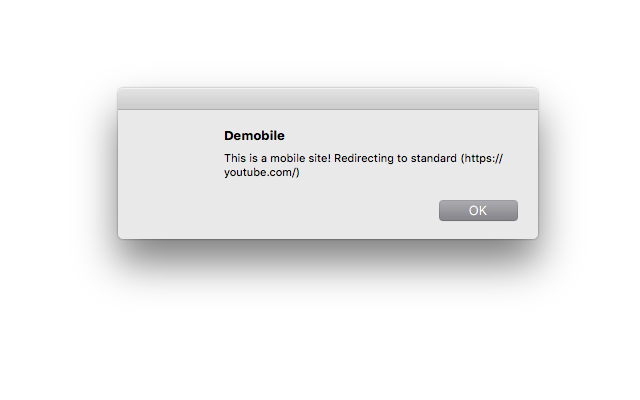

# demobile
redirect \*.m.\* | \*.mobile.\* URLs to desktop versions

Do you get annoyed by clicking links that land you on a mobile site? Redirect to the standard site by default!

[Install now!]("https://chrome.google.com/webstore/detail/poikbhnlblolailelfnhbdifkdhhmikm")

